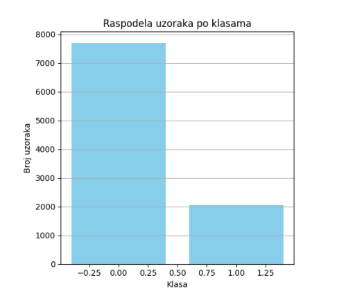
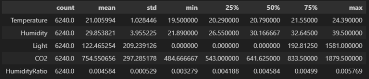
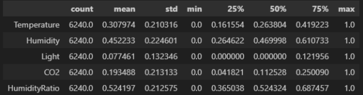
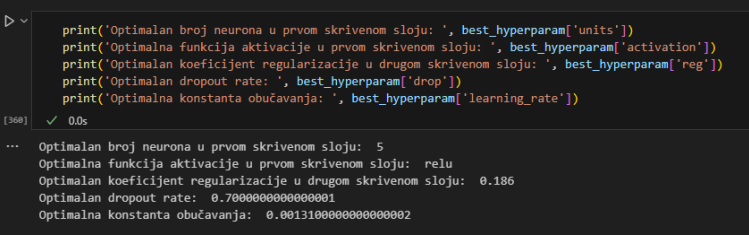
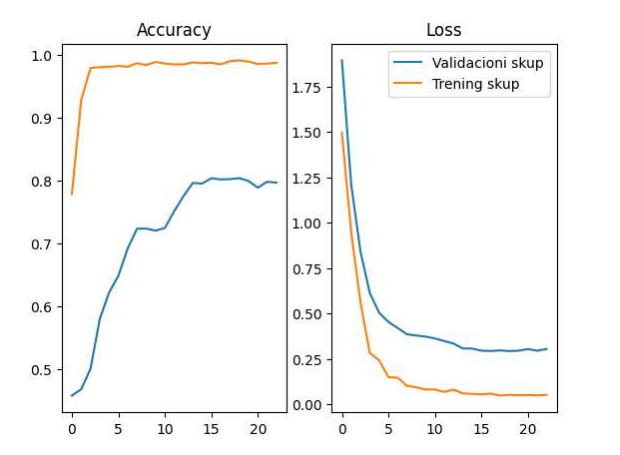
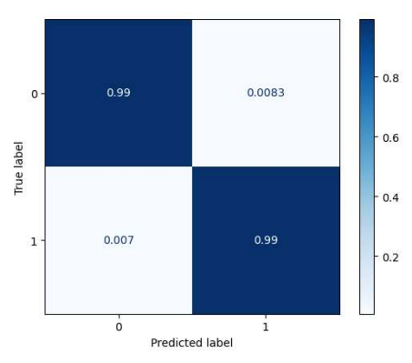
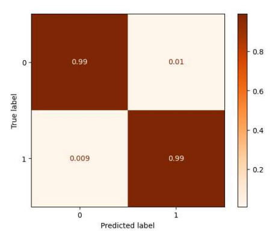

# Room Occupancy Classification using Neural Networks

Binary classification of room occupancy status based on environmental sensor data using deep learning techniques.

## Project Description

This project implements a neural network classifier to predict room occupancy based on environmental measurements including temperature, humidity, light, CO2 levels, and humidity ratio. The model uses Keras with hyperparameter tuning to achieve optimal performance on imbalanced dataset.

## Dataset

The dataset contains 9,753 samples with 5 environmental features and 1 binary target variable:

**Features:**
- Temperature (degrees Celsius)
- Humidity (percentage)
- Light (lux)
- CO2 (ppm)
- Humidity Ratio (derived feature)

**Target:**
- Occupancy (0 = unoccupied, 1 = occupied)

### Class Distribution

<div align="center">



</div>

The dataset exhibits significant class imbalance with the majority of samples belonging to the unoccupied class. This imbalance is addressed using class weighting during training.

**Computed Class Weights:**
- Class 0 (Unoccupied): 0.62979
- Class 1 (Occupied): 2.42613

These weights are calculated using the balanced method, which inversely weights classes proportional to their frequency in the training data. This ensures that the minority class (occupied) receives higher importance during model training.

## Model Architecture

The neural network consists of:
- Input layer (5 features)
- First hidden layer with configurable neurons and activation function
- Batch normalization
- Second hidden layer with 5 neurons, L2 regularization, and ReLU activation
- Batch normalization
- Dropout layer
- Output layer with sigmoid activation

## Methodology

### Data Preprocessing

1. **Train-Validation-Test Split:**
   - Training set: 64%
   - Validation set: 16%
   - Test set: 20%

2. **Feature Normalization:**
   - MinMax scaling applied to all features to transform values into [0, 1] range
   - Scaler fitted on training data only to prevent data leakage
   - Same transformation applied to validation and test sets

    **Statistics before normalization:**
   
   <div align="center">
   
   
   
   </div>

   
   **Statistics after normalization:**
   
   <div align="center">
   
   
   
   </div>

3. **Class Imbalance Handling:**
   - Balanced class weights computed using sklearn's `compute_class_weight`
   - Weights applied during model training via `class_weight` parameter
   - Class 0 (Unoccupied): 0.62979
   - Class 1 (Occupied): 2.42613

### Hyperparameter Tuning

Random search is performed using Keras Tuner to optimize:
- Number of neurons in first hidden layer (3-15)
- Activation function (sigmoid, relu, tanh)
- L2 regularization coefficient (0.001-0.5)
- Dropout rate (0-0.8)
- Learning rate (0.00001-0.01)

**Optimal Hyperparameters:**



### Training

- Optimizer: Adam
- Loss function: Binary crossentropy
- Early stopping with patience=5 on validation loss
- Maximum 100 epochs
- Batch size: 32

## Results

### Training Performance

<div align="center">



</div>

The plots show accuracy and loss curves for both training and validation sets across epochs.

### Test Set Evaluation

**Confusion Matrix (Training Set):**

<div align="center">



</div>

**Confusion Matrix (Test Set):**

<div align="center">



</div>

**Performance Metrics:**

| Metric | Score |
|--------|-------|
| Accuracy | 98.82% |
| Precision | 98.86% |
| Recall | 98.82% |
| F1-Score | 98.83% |

**Class-wise Metrics:**

| Class | Accuracy | Precision | Recall | F1-Score |
|-------|----------|-----------|--------|----------|
| 0 (Unoccupied) | 99.0% | 99.3% | 98.7% | 99.0% |
| 1 (Occupied) | 99.0% | 98.7% | 99.3% | 99.0% |

## Requirements

```
numpy
pandas
matplotlib
scikit-learn
keras
tensorflow
keras-tuner
scikeras
imbalanced-learn
```

## Technical Details

### Model Configuration

The model uses several regularization techniques to prevent overfitting:
- L2 regularization on the second hidden layer
- Dropout after the second hidden layer
- Batch normalization after each hidden layer
- Early stopping during training

### Evaluation Strategy

Model performance is evaluated using:
- 3-fold cross-validation for robustness assessment
- Confusion matrices normalized by true class
- Multiple classification metrics (accuracy, precision, recall, F1-score)
- Class-specific performance analysis
